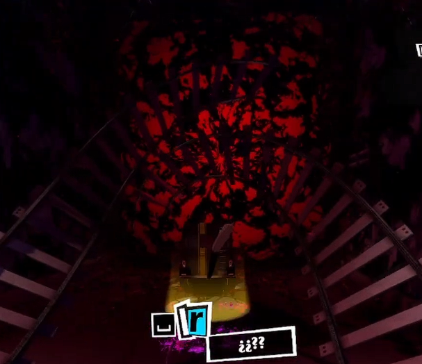

# Shaders 

## Índice

- [Tarea Propuesta](#tarea-propuesta)
- [Implementación](#implementación)
  - [Tiny Code](#tiny-code)
    - [Representación](#representación-tiny-code)
    - [Código](#código-tiny-code)
  - [Experimentación](#experimentación)
    - [Inspiración](#inspiración)
    - [Código](#código-experimentación)
- [Referencias](#referencias)

## Tarea Propuesta

La tarea propuesta para esta práctica es la realización de un shader de fragmentos con patrón generativo de manera que pueda ejecutarse desde el [editor de The Book of Shaders](http://editor.thebookofshaders.com). De esta forma, a continuación mostraremos 2 shaders: uno en "tiny code" y otro realizado por pura experimentación.

## Implementación

### Tiny Code

#### Representación Tiny Code

Para la versión **tiny code** se ha decidido tomar como referencia la estética de las distorsiones presentes en la Mementos del videojuego "Persona 5". Estas distorsiones destacan por presentarse como una "brecha" en la pared, en cuyo interior se forma un "remolino" de tintes rojos y negros. 

El shader que se ha desarrollado busca replicar la esencia de estas distorsiones, adaptándose dicha referencia haciendo uso de ondas radiales y angulares, deformaciones trigonométricas animadas y una máscara basada en interferencias, permitiendo conseguir esa sensación de "torbellino" que generan las brechas en la cognición en el videojuego.

De esta forma, me interesa representar de la forma más fiel posible estas perturbaciones del inconsciente colectivo.



#### Código Tiny Code

En primer lugar, definimos la precisión que vamos a utilizar en el código. Para este caso, hemos decidido que una precisión de tipo **mediump float** es más que suficiente para lo que queremos representar.
De igual manera, definimos el tamaño de la pantalla y el tiempo para poder animar el shader con los uniforms **u_resolution** y **u_time**.

```
#ifdef GL_ES
precision mediump float;
#endif
uniform vec2 u_resolution;
uniform float u_time;
```

Ya dentro de la función principal main(), normalizamos las coordenadas entre 0 y 1 con el **vector uv**, así como aplicamos una corrección en **uv.x** para asegurar que el patrón no se deforme en pantallas que no sean cuadradas.

```
vec2 uv = gl_FragCoord.xy / u_resolution.xy;
uv.x *= u_resolution.x / u_resolution.y;
```

Para crear la rejilla en la que mostraremos el shader, utilizaremos un parámetro g para controlar las repeticiones en pantalla (en este 4, 2 por fila), un vector de 2 dimensiones **gv** para escalar las coordenadas y un vector de dos dimensiones **st** para normalizar en el intervalor [-1,1] las distintas celdas y manipularlas de manera individual.

```
float g = 2.;
vec2 gv = uv * g;
vec2 st = fract(gv) * 2. - 1.;
```

A continuación, para añadirle animación a cada celda del patrón haremos principalmente dos cosas:

- Escalar el tiempo **u_time** para poder controlar de esta forma la velocidad del movimiento. El valor resultante **t** lo utilizaremos para desplazar las coordenadas **st** mediante senos y cosenos.

- Desplazamiento utilizando senos y cosenos. Al vector resultante **st** se le aplicará una función seno en el eje x y una función coseno en el eje y. De esta forma, y habiendo limitado la amplitud del desplazamiento a 0,05, conseguimos que se produzcan ondulaciones y deformaciones leves.

```
float t = u_time * 0.6;
st += 0.05 * vec2(sin(5. * st.y + t), cos(5. * st.x + t));

```

Para poder representar correctamente, transformarmos las coordeandas de cartesianas a polares:

- **r** representa la distancia desde el píxel hasta el centro de la celda. Esta variable se utilizará para generar los patrones radiales.

- El parámetro **a** hace referencia al ángulo de cada punto dentro de la celda. Cabe aclarar que no se hace uso del ángulo completo de 360*, sino que se segmenta haciendo uso de la operación **mod**, para poder obtener una geometría hexagonal.
De esta forma, podemos simular de alguna forma esas franjas rojas y negras descritas anteriormente.

```
float r = length(st);
float a = mod(atan(st.y, st.x) + t * 0.3, 6.2831 / 6.) - 3.14159 / 6.;
```

A continuación, haremos uso de los parámetros descritos anteriormente para generar la intensidad del patrón a partir de la combinación de dos ondas sinusoidales:

- **Componente radial (sin(r * 40. - t * 4.))**: para la componente radial multiplicamos por un factor 40, permitiendo de este modo que existan muchas oscilaciones dentro de cada celda. Al multiplicar la componente t por el valor 4 estamos consiguiendo propagar la onda en el tiempo según como queramos.

- **Componente angular (sin(a * 12. + r * 12.))**: multiplicamos el ángulo a por 12 para reforzar la geometría hexagonal producida anteriormente. El término añadido a esta ( + r*12), permite que se mezclen ambos dominios para producir estructuras más complejas.

El multiplicar ambas componentes hace que se generen interferencias, de modo que habrá zonas donde ambas ondas refuercen su amplitud y otras donde se cancelen. De este modo, se consigue el efecto que andábamos buscando.
Para suavizar el resultado se aplica la función **smoothstep**, de modo que aquellas intesidades superiores a 0.02 serán filtradas, obteniendo de esta forma líneas finas y suaves.

```
float m = smoothstep(0., 0.02, sin(r * 40. - t * 4.) * sin(a * 12. + r * 12.));
```

Finalmente, la máscara **m** que acabamos de crear será utilizada como factor de multiplicación para el color elegido (en nuestro caso rojo). De esta forma, si m es 0 implicará que el fragmento será negro, mientras que sí es 1 el fragmento se mostrará de color rojo.
```
gl_FragColor = vec4(vec3(1, 0, 0) * m, 1.);
```

Si ejecutamos todo el código tal y como se encuentra en el fichero **"tinyCode_deformation.frag"** obtendremos la siguiente representación:

```
#ifdef GL_ES
precision mediump float;
#endif
uniform vec2 u_resolution;
uniform float u_time;
void main(){
 vec2 uv=gl_FragCoord.xy/u_resolution.xy;
 uv.x*=u_resolution.x/u_resolution.y;
 float g=2.;
 vec2 gv=uv*g,st=fract(gv)*2.-1.;
 float t=u_time*.6;
 st+=.05*vec2(sin(5.*st.y+t),cos(5.*st.x+t));
 float r=length(st),a=mod(atan(st.y,st.x)+t*.3,6.2831/6.)-3.14159/6.;
 float m=smoothstep(0.,.02,sin(r*40.-t*4.)*sin(a*12.+r*12.));
 gl_FragColor=vec4(vec3(1,0,0)*m,1.);
}
```


### Experimentación

Adicionalmente a la tarea, también se ha realizado otro shader (un tanto más pesado) experimentado con uno de los shaders mostrados en el [guión de la práctica](https://github.com/otsedom/otsedom.github.io/blob/main/IG/S9/README.md#shaders).

#### Inspiración

El shader en cuestión con el que he decidido experimentar es la **estrella con semipétalos**.

Al verla y analizarla durante un tiempo pensé en que se podía transformar en una especie de fuego artificial. De esta forma, recordé que en el videojuego "Persona 5" hay una escena de fuegos artificiales que queda arruinada por la lluvia y, como homenaje a ese espectáculo arruinado, quise ver como podría implementar eso como shader.


#### Código Experimentación

El shader genera un paatrón animado que asemeja fuegos artificiales haciendo uso de una estrella con semipétalos. Cada una de las formas de dicho patrón se construye con varias capas superpuestas que se deforman y animan según pasa el tiempo para crear un efecto de "explosión"del fuego artificial.

Para organizar la composición, dividimos la pantalla en una cuadrícula en la que cada celda dispone de sus propias coordenadas internas. Esto permite que cada “flor” tenga su propio movimiento, dirección de giro y velocidad, determinados por el identificador de la celda. De esta forma evitamos que se sienta todo muy exacto y le otorgamos algo de dinamismo. 

La creación de las flores se obtiene a partir de una función **flowerLayer**, la cual hace uso de los ángulos y distancia hacia el centro de cada uno de los pétalos, definiendo la forma base de la flor. A esta base, se le añade una onda animada de color negro que pretende replicar el efecto de un fuego artificial al explotar.

Finalmente cada celda recibe un color diferente en función de su posición, de modo que podemos tener explosiones de diferentes tonalidades.

A continuación, se inserta el código completo de "fireworks.frag" y el resultado de su ejecución:

```
#ifdef GL_ES
precision mediump float;
#endif

#define PI 3.14159265359
#define PI2 (PI*2.)

uniform vec2 u_resolution;
uniform float u_time;
 
mat2 rotate2d(float a){
    return mat2(cos(a), -sin(a),
                sin(a),  cos(a));
}

float flowerLayer(vec2 st, int N, float scale, float timeShift){
    
    st /= scale; // Escalamos la capa

    float a = atan(st.x, st.y) + PI; // Calculamos el ángulo
    float r = PI2 / float(N); // Callculamos el tamaño angular de cada pétalo

    float d = cos(floor(0.5 + a/r)*r - a) * (length(st) + mod(a, r)); // Definimos la forma base del pétalo

    float base = 1.0 - smoothstep(0.40, 0.41, d); // Suavizamos el borde del pétalo

    float len = length(st);
    float wave = 0.5 + 0.85 * sin((len*20.0 - u_time*3.0) + timeShift); // Onda para dar animación al patrón

    return base * wave; // Retornamos el resultado final de la capa
}

void main(){
    
    // Normalización de las coordenadas y corrección de aspecto
    vec2 uv = gl_FragCoord.xy / u_resolution.xy;
    uv.x *= u_resolution.x / u_resolution.y;

    // Visualización en cuadrícula
    float grid = 3.0;
    vec2 gv = uv * grid;  
    vec2 id = floor(gv);
    vec2 st = fract(gv) * 2.0 - 1.0;

    // Rotaciones dispares
    float direction = mod(id.x + id.y, 2.0) * 2.0 - 1.0; 
    float speed = 0.5 + 0.5*mod(id.x + id.y, 2.0); // La velocidad varía según la celda
    float rotation = direction * u_time * speed;
    st = rotate2d(rotation) * st; // Aplicamos la rotación calculada

    // Movimiento lateral para aportar realismo
    float moveDir = direction; 
    float moveSpeed = 0.2;
    st.x += moveDir * sin(u_time*2.0 + id.x + id.y) * moveSpeed;
	
    // Añadimos varias capas para aportar "profundidad"
    float result = 0.0;
    result += flowerLayer(st, 13, 1.0, id.x + id.y);
    result += flowerLayer(st, 13, 1.3, id.x*0.5 + id.y*0.7);
    result += flowerLayer(st, 13, 1.7, id.x*1.0 + id.y*0.3);
    
    // Calculamos el color según la celda
    float t = sin(id.x*12.3 + id.y*7.1);
    vec3 col = vec3(
        0.25 + 0.9*sin(t + 0.5),
        0.05 + 0.5*sin(t + 2.0),
        0.5 + 0.85*sin(t + 4.0)
    ) * result;
    
    gl_FragColor = vec4(col, 1.0); // Asignamos color
}
```


## Referencias

- [Documentación Threejs](https://threejs.org/docs)
- [The Book of Shaders](https://thebookofshaders.com/glossary)
- [Guión de la práctica de Shaders](https://github.com/otsedom/otsedom.github.io/blob/main/IG/S9/README.md#shaders)
